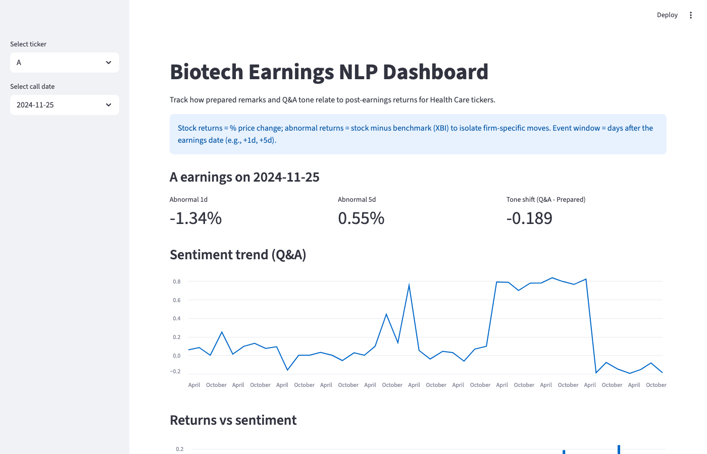

# Earnings NLP for Biotech

This project ingests biotech earnings call transcripts, scores sentiment, and links language to stock reactions around the event date. It focuses on the Q&A section because unscripted answers often reveal incremental information beyond the prepared remarks.

## Motivation & Approach
- Split each transcript into **prepared remarks** (scripted) and **Q&A** (unscripted analyst questions and management answers).
- Score sentiment with **FinBERT** for both sections; compute **tone_shift = Q&A − prepared** to capture changes in tone when management is pressed.
- Add domain features such as **hedging language** and **regulatory-risk terms** common in biotech (e.g., FDA, clinical hold, adverse event).
- Link calls to **price data** and compute **returns** and **abnormal returns** relative to a biotech benchmark (XBI) over short event windows (+1d, +5d).
- Analyze how Q&A tone, tone shifts, and risk language relate to post-earnings reactions using t-tests, regression, and a simple logistic model.

## Key Concepts
- **Earnings calls**: Company-hosted calls where executives discuss financial results and outlook with analysts and investors.
- **Q&A section**: Portion of the call where analysts ask questions and management responds; often reveals new information beyond prepared remarks.
- **Stock returns**: Percentage change in a stock price over a period, e.g., 1-day or 5-day moves.
- **Abnormal returns**: Stock returns minus a benchmark (here, a biotech ETF) to isolate firm-specific moves.
- **Event windows**: Short windows around the earnings date (e.g., +1d, +5d) used to measure market reaction to the event.

## Finance Math (event-study basics)
- **Single-day return** on day *t*  
  $r_t = \dfrac{P_t - P_{t-1}}{P_{t-1}}$
- **Event-window return** from start to end date  
  $R_{\text{window}} = \dfrac{P_{\text{end}} - P_{\text{start}}}{P_{\text{start}}}$
- **Abnormal return** relative to a benchmark (here XBI)  
  $\text{AR}_{\text{window}} = R_{\text{stock, window}} - R_{\text{benchmark, window}}$  
  (isolates firm-specific reaction by netting out sector moves)
- **Tone shift**  
  $\text{tone\_shift} = \text{sentiment}_{\text{Q\&A}} - \text{sentiment}_{\text{prepared}}$  
  (positive = tone improves under Q&A; negative = tone worsens)
- Optional if available: **earnings surprise**  
  $\text{Surprise} = \text{EPS}_{\text{actual}} - \text{EPS}_{\text{consensus}}$  
  (control for beat/miss when testing language effects)

## Pipeline Overview
1. **Transcripts**: Load HuggingFace dataset `glopardo/sp500-earnings-transcripts` and filter to Health Care.
2. **Sentiment**: Split prepared remarks vs. Q&A, then score each with FinBERT to capture tone and tone shifts.
3. **Event Returns**: Pull prices via `yfinance`, compute 1-day and 5-day returns plus benchmark-adjusted abnormal returns.
4. **Analysis**: Explore distributions, run statistical tests, and build simple predictive models on language features.

## Getting Started
1. Install dependencies: `pip install -r requirements.txt`
2. Configure paths and tickers in `config/config.yaml`.
3. Ingest data: `python src/ingest/hf_ingest.py --config config/config.yaml`
4. Compute returns: `python src/finance/compute_returns_for_events.py --config config/config.yaml`
5. Split transcripts: `python src/preprocess/split_all_transcripts.py --config config/config.yaml`
6. Add sentiment: `python src/features/compute_sentiment_features.py --config config/config.yaml`
7. Add text stats: `python src/features/compute_text_stats.py --config config/config.yaml`
8. Explore: run `streamlit run app.py` or open `notebooks/01_exploration.ipynb`.

## Dashboard Preview


## Repository Structure
```
.
├── config/               # YAML config for dataset and paths
├── data_processed/       # Parquet outputs
├── data_raw/             # Optional raw artifacts
├── notebooks/            # Exploration notebook
├── src/                  # Ingest, preprocessing, features, finance, analysis
└── tests/                # Pytest suite
```
